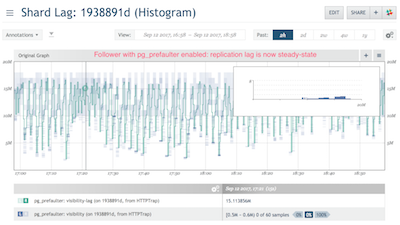

= `pg_prefaulter`
include::front-matter.adoc[]
:keywords: postgresql, go, wal, fault, prefault, replication

This repository is part of the Joyent Manta project. See [CONTRIBUTING.md](CONTRIBUTING.md) for contribution guidelines.

[[introduction]]
== Introduction

https://github.com/joyent/pg_prefaulter[`pg_prefaulter`] is used to mitigate the
effects of PostgreSQL replication lag.

In a primary-follower database cluster using PostgreSQL streaming replication,
the PostgreSQL's primary database instance enjoys the benefit of being able to
parallelize its random IO workload.  The follower, however, is not so fortunate.
The follower receives a sequential stream of WAL records and sequentially
schedules all `pread(2)` IOs in order in a single process with blocking IO.  If
the average IO latency per random `pread(2)` is ~8ms, that means that the
follower can only complete ~125 random IO `pread(2)` calls per second.

The `pg_prefaulter` reads the stream of WAL records using
https://www.postgresql.org/docs/current/static/pgxlogdump.html[`pg_xlogdump(1)`]
and schedules concurrent IOs in order to prefault PostgreSQL heap pages into the
follower's filesystem cache.  The effect of this is dramatic in that the
follower is able to apply pages with a filesystem cache-hit.

`pg_prefaulter` is also smart enough to pull the WAL file from process arguments
which allows `pg_prefaulter` to prefault pages in order to accelerate the
recovery and startup time of PostgreSQL.  If you've ever sat twiddling your
thumbs waiting for the database to start up, `pg_prefaulter` should improve the
startup time of PostgreSQL.

If you've seen replication lag due to
https://github.com/reorg/pg_repack/[`pg_repack`],
https://www.postgresql.org/docs/current/static/sql-vacuum.html[`VACUUM`], or a
write-heavy workload, the `pg_prefaulter` should reduce apply lag considerably.
See the <<background,Background section>> for additional details.

[[usage]]
== Usage

[source,sh]
----
$ go get github.com/joyent/pg_prefaulter                // <1>
$ pg_prefaulter run                                     // <2>
$ pg_prefaulter -l DEBUG run                            // <3>
$ pg_prefaulter -l DEBUG run -D .pgdata_primary -p 5433 // <4>
$ pg_prefaulter -h                                      // <5>
$ pg_prefaulter run -h                                  // <6>
----
<1> Build and install `pg_prefaulter` into `$GOPATH/bin` (where `GOPATH` is
    likely `go env GOPATH`).
<2> The default mode of running `pg_prefaulter`
<3> Run `pg_preafulter` with ``DEBUG``-level logging.
<4> Run `pg_prefaulter` with various PG connect options.
<5> `pg_prefaulter` global help options
<6> ``pg_prefaulter``'s ``run``-specific options

NOTE: `pg_prefaulter` exposes itself as a https://github.com/google/gops[`gops`
client] and also exposes `expvar` metrics.

https://github.com/divan/expvarmon[`expvarmon`] can be used to interactively
monitor the state of `pg_prefaulter`:

[source,sh]
----
$ expvarmon -ports 4242 -i 1s -vars "mem:memstats.Alloc,mem:memstats.Sys,mem:memstats.HeapAlloc,mem:memstats.HeapInuse,duration:memstats.PauseNs,duration:memstats.PauseTotalNs,str:sender-state,str:peer-sync-state,mem:durability-lag,mem:flush-lag,mem:visibility-lag,duration:visibility-lag_ms,str:db-state,str:connected,str:timeline-id,num-wal-files,num-concurrent-reads,num-concurrent-wals"
----

[[config]]
== Configuration Files

The following is an example configuration file.  This can be used instead of CLI
arguments.  The default configuration filename is `pg_prefaulter.toml`.  The
following is a reasonable default `pg_prefaulter.toml` configuration file.

[source,toml,numbered]
----
[log]
# level can be set to "DEBUG", "INFO", "WARN", "ERROR", or "FATAL"
#level = "INFO"

[postgresql]
#pgdata = "pgdata"
#database = "postgres"
#host = "/tmp"
#password = ""
#port = 5432
#user = "postgres"

[postgresql.xlog]
#pg_xlogdump-path = "/usr/local/bin/pg_xlogdump"

[circonus]
#enabled = true

[circonus.api]
# token is a required value if circonus.enabled=true
#token = ""

[circonus.broker]
# id should be set to "35" (the public HTTPTrap broker) if you have enterprise
# brokers configured in your account.
#id = 35

[circonus.check]
#tags = "dc1:mydc"
----

A complete configuration file with all options listed can be seen in
`pg_prefaulter.toml.sample-all`.

[[cli-usage]]
== CLI Help

=== Global Help

[source,sh]
----
$ pg_prefaulter --help

PostgreSQL's WAL-receiver applies WAL files in serial.  This design implicitly
assumes that the heap page required to apply the WAL entry is within the
operating system's filesystem cache.  If the filesystem cache does not contain
the necessary heap page, the PostgreSQL WAL apply process will be block while
the OS faults in the page from its storage.  For large working sets of data or
when the filesystem cache is cold, this is problematic for streaming replicas
because they will lag and fall behind.

pg_prefaulter(1) mitigates this serially scheduled IO problem by
reading WAL entries via pg_xlogdump(1) and performing parallel pread(2) calls in
order to "pre-fault" the page into the OS's filesystem cache so that when the
PostgreSQL WAL receiver goes to apply a WAL entry to its heap, the page is
already loaded into the OS'es filesystem cache.

Usage:
  pg_prefaulter [command]

Available Commands:
  help        Help about any command
  run         Run pg_prefaulter
  version     pg_prefaulter version information

Flags:
  -a, --circonus-api-key string                         Circonus API token
      --circonus-api-url string                         Circonus API URL (default "https://api.circonus.com/v2")
      --circonus-broker-id string                       Circonus Broker ID
      --circonus-broker-max-response-time string        Circonus Broker Max Response Time (default "500ms")
      --circonus-broker-select-tag string               Circonus Broker Select Tag
      --circonus-check-display-name string              Circonus Check Display Name (default "pg_prefaulter")
      --circonus-check-force-metric-activation string   Circonus Check Force Metric Activation (default "false")
      --circonus-check-id string                        Circonus Check ID
      --circonus-check-instance-id string               Circonus Check Instance ID (default "tenacity.local:pg_prefaulter")
      --circonus-check-max-url-age string               Circonus Check Max URL Age (default "5m")
      --circonus-check-search-tag string                Circonus Check Search Tag (default "app:pg_prefaulter,host:tenacity.local")
      --circonus-check-secret string                    Circonus Check Secret
      --circonus-check-tags string                      Circonus Check Tags (default "app:pg_prefaulter")
      --circonus-check-target-host string               Circonus Check Target Host (default "tenacity.local")
      --circonus-debug                                  Enable Circonus Debug
      --circonus-enable-metrics                         Enable Circonus metrics (default true)
      --circonus-submission-url string                  Circonus Check Submission URL
      --config string                                   config file (default "pg_prefaulter.toml")
  -d, --database string                                 postgres (default "postgres")
      --enable-agent                                    Enable the gops(1) agent interface (default true)
      --enable-pprof                                    Enable the pprof endpoint interface (default true)
  -h, --help                                            help for pg_prefaulter
  -H, --hostname string                                 Hostname to connect to PostgreSQL (default "/tmp")
  -F, --log-format string                               Specify the log format ("auto", "zerolog", "human", or "bunyan") (default "auto")
  -l, --log-level string                                Log level (default "INFO")
  -D, --pgdata string                                   Path to PGDATA (default "pgdata")
  -p, --port uint                                       Hostname to connect to PostgreSQL (default 5432)
      --pprof-port uint16                               Specify the pprof port (default 4242)
  -C, --use-color                                       Use ASCII colors (default true)
  -U, --username string                                 Username to connect to PostgreSQL (default "postgres")

Use "pg_prefaulter [command] --help" for more information about a command.
----

=== Run Help

[source,sh]
----
$ pg_prefaulter run --help
Run pg_prefaulter and begin faulting in PostgreSQL pages

Usage:
  pg_prefaulter run [flags]

Flags:
  -h, --help                         help for run
  -m, --mode string                  Mode of operation of the database: "auto", "primary", "follower" (default "auto")
  -N, --num-io-threads uint          Number of IO threads to spawn for IOs
  -i, --poll-interval string         Interval to poll the database for state change (default "1s")
      --retry-db-init                Retry connecting to the database during initialization
  -n, --wal-readahead-bytes string   Maximum number of bytes to pre-fault (default "32MiB")
  -X, --xlog-mode string             pg_xlogdump(1) variant: "xlog" or "pg" (default "pg")
  -x, --xlogdump-bin string          Path to pg_xlogdump(1) (default "/usr/local/bin/pg_xlogdump")

Global Flags:
  -a, --circonus-api-key string                         Circonus API token
      --circonus-api-url string                         Circonus API URL (default "https://api.circonus.com/v2")
      --circonus-broker-id string                       Circonus Broker ID
      --circonus-broker-max-response-time string        Circonus Broker Max Response Time (default "500ms")
      --circonus-broker-select-tag string               Circonus Broker Select Tag
      --circonus-check-display-name string              Circonus Check Display Name (default "pg_prefaulter")
      --circonus-check-force-metric-activation string   Circonus Check Force Metric Activation (default "false")
      --circonus-check-id string                        Circonus Check ID
      --circonus-check-instance-id string               Circonus Check Instance ID (default "tenacity.local:pg_prefaulter")
      --circonus-check-max-url-age string               Circonus Check Max URL Age (default "5m")
      --circonus-check-search-tag string                Circonus Check Search Tag (default "app:pg_prefaulter,host:tenacity.local")
      --circonus-check-secret string                    Circonus Check Secret
      --circonus-check-tags string                      Circonus Check Tags (default "app:pg_prefaulter")
      --circonus-check-target-host string               Circonus Check Target Host (default "tenacity.local")
      --circonus-debug                                  Enable Circonus Debug
      --circonus-enable-metrics                         Enable Circonus metrics (default true)
      --circonus-submission-url string                  Circonus Check Submission URL
      --config string                                   config file (default "pg_prefaulter.toml")
  -d, --database string                                 postgres (default "postgres")
      --enable-agent                                    Enable the gops(1) agent interface (default true)
      --enable-pprof                                    Enable the pprof endpoint interface (default true)
  -H, --hostname string                                 Hostname to connect to PostgreSQL (default "/tmp")
  -F, --log-format string                               Specify the log format ("auto", "zerolog", "human", or "bunyan") (default "auto")
  -l, --log-level string                                Log level (default "INFO")
  -D, --pgdata string                                   Path to PGDATA (default "pgdata")
  -p, --port uint                                       Hostname to connect to PostgreSQL (default 5432)
      --pprof-port uint16                               Specify the pprof port (default 4242)
  -C, --use-color                                       Use ASCII colors (default true)
  -U, --username string                                 Username to connect to PostgreSQL (default "postgres")
----

[[development]]
== Development

1. `make freshdb-primary`
2. `make freshdb-follower`
3. `make resetdb`
4. `make build`
5. `make check`
6. `./pg_prefaulter ...` # Iterate

To cross-compile and build a release use
https://github.com/goreleaser/goreleaser[`goreleaser`] and the `make release` or
`make release-snapshot` targets.  For development, the following should be
sufficient:

1. `go get -u github.com/goreleaser/goreleaser`
2. `goreleaser --snapshot --skip-validate --skip-publish --rm-dist`

[source,sh]
----
$ make
pg_prefaulter make(1) targets:
build            Build pg_prefaulter binary
check            Run go test
fmt              fmt and simplify the code
release-snapshot  Build a snapshot release
release          Build a release
vendor-status    Display the vendor/ status
vet              vet the binary (excluding dependencies)

cleandb-primary  Clean primary database
freshdb-primary  Drops and recreates the primary database
initdb-primary   initdb(1) a primary database
psql-primary     Open a psql(1) shell to the primary
startdb-primary  Start the primary database

cleandb-follower  Clean follower database
freshdb-follower  Drops and recreates the follower database
initdb-follower  initdb(1) a follower database
psql-follower    Open a psql(1) shell to the follower
startdb-follower  Start the follower database

createdb         Create the test database
dropdb           Reset the test database
gendata          Generate data in the primary
resetdb          Drop and recreate the database
testdb           Run database tests

controldata      Display pg_controldata(1) of the primary
psql             Open a psql(1) shell to the primary

clean            Clean target
cleandb-shard    Clean entire shard

help             This help message
----

[[background]]
== Background

PostgreSQL forks a separate process to handle each connection to the database.
As database worker processes handle work, they modify database files and commit
transactions.  Commit of a database transaction flushes an entry into the
write-ahead-log (WAL).

PostgreSQL's streaming-based replication system is based on "log-shipping:" the
WAL is streamed to remote hosts.  Database replicas apply the changes listed in
the instructions within the WAL using the PostgreSQL crash recovery mechanism:
they read the log from beginning to end, find the changes to the underlying
datafiles (the "PostgreSQL Heap", or "Heap" for short) and make the relevant
changes to the database files.

The replica's WAL-apply operation is performed in a single process, using a
single thread.  Each time a WAL-entry is "consumed" as the replica reads in the
corresponding page of the underlying datafile.  The WAL-replay process on the
replica waits for the serial execution of disk I/O to complete and load the
underlying page(s) from the heap.  Unlike the primary, the follower lacks the
ability to spread its work across multiple processes.  As a consequence, the
replicas only perform single-process, single-threaded, blocking IO, and cannot
apply the WAL as quickly as the primary who generates the WAL files and are
using parallel IO.  To add insult to injury, the follower is prone to having its
filesystem cache fault, resulting in a physical disk IO, further slowing down
the apply process.

Fortunately, the WAL-itself gives perfect information to the replica regarding
what I/O operations will be required (for example, "write 50 bytes to relation
16439 at block number 2357235235").  However, for correctness of transaction
commit it is important that the WAL be replayed in-order.  The `pg_prefaulter`
is a helper application for the replica: it queries the replica PostgreSQL
process for information about where it is in the replay.  The `pg_prefaulter`
then uses the information encoded in the WAL files themselves to initiate
async-I/O operations (with a configurable degree of concurrency) with the goal
of giving the operating system a chance to load the file into the filesystem
cache before the PostgreSQL startup process (e.g. `postgres: startup process
recovering 00000001000002870000005E`) fetches the page from the filesystem.
Once the portions of the database files are resident in filesystem cache, the
PostgreSQL replica will be able to access them without having to wait so long
because the necessary page will already be resident in the filesystem cache.
The end result is that even though the replica is still a single-process with a
single thread, access to random pages will return quickly because the `pread(2)`
call will result in a filesystem cache-hit operation (versus the pessimistic
path where the page faults in both PostgreSQL's cache, the VFS cache, and the
apply process blocks performing an an extended `pread(2)` operation).

Before:: Replication apply lag before and during the recovery once `pg_prefaulter` was deployed
  image:images/lag_recovery_thumb.png["Apply Lag recovery",height=400,link="images/lag_recovery.png"]
After:: Replication apply lag as observed during the same workload seen earlier while `pg_prefaulter` is still running
  
